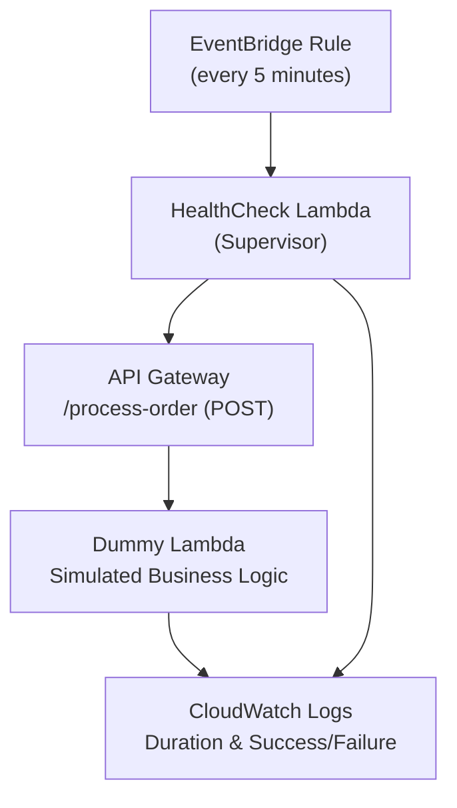

# Business health check example

### ASCII diagram for the business health check example:

                        ┌────────────────────┐
                        │   EventBridge Rule │
                        │ (every 5 minutes)  │
                        └────────┬───────────┘
                                 │
                                 ▼
                       ┌──────────────────────┐
                       │  HealthCheck Lambda  │◄──┐
                       │  (Supervisor)        │   │
                       └────────┬─────────────┘   │
                                │                 │
                                ▼                 │
                  ┌─────────────────────────────┐ │
                  │  API Gateway                │ │
                  │  /process-order (POST)      │ │
                  └────────┬────────────────────┘ │
                           │                      │
                           ▼                      │
                ┌──────────────────────────┐      │
                │ Dummy Lambda (Handler)   │      │
                │ Simulates business logic │      │
                └──────────────────────────┘      │
                           │                      │
                           ▼                      │
               ┌────────────────────────────┐     │
               │ CloudWatch Logs (metrics,  │     │
               │ duration, success/failure) │◄────┘
               └────────────────────────────┘

### Mermaid diagram for the business health check example:

