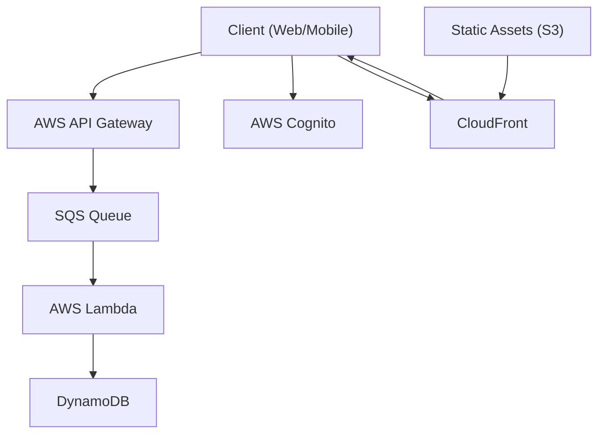

# Serverless Compute services
When it comes to serverless compute on AWS, the two main services to consider are **AWS Lambda** and **Amazon ECS Fargate**. Both services allow you to run code without managing servers, but they have different use cases and characteristics.
## AWS Lambda
AWS Lambda is a serverless compute service that lets you run code in response to events and automatically manages the underlying compute resources for you. You can use Lambda to run code for virtually any type of application or backend service, all with zero administration. 

## Amazon ECS Fargate
Amazon ECS Fargate is a serverless compute engine for containers. It allows you to run containers without having to manage the underlying infrastructure. With Fargate, you can focus on designing and building your applications instead of managing the infrastructure that runs them.

## AWS Fargate on EKS

### Overview
AWS Fargate can be used with Amazon EKS (Elastic Kubernetes Service) to run Kubernetes pods without managing EC2 instances. This provides a truly serverless Kubernetes experience where you only pay for the pod resources you use.

### How It Works
- **Fargate Profile**: Defines which pods run on Fargate based on namespace and label selectors
- **Pod Execution**: When a pod matches a Fargate profile, EKS automatically provisions and manages the infrastructure
- **Isolation**: Each pod runs on its own dedicated compute environment (no sharing with other pods)
- **Integration**: Works seamlessly with EKS control plane and native Kubernetes APIs

### Fargate Profile Configuration
```yaml
apiVersion: eksctl.io/v1alpha5
kind: ClusterConfig
metadata:
  name: my-cluster
  region: us-west-2

fargateProfiles:
  - name: fp-default
    selectors:
      - namespace: default
      - namespace: kube-system
  - name: fp-production
    selectors:
      - namespace: production
        labels:
          workload: serverless
```

### Key Differences: Fargate on EKS vs ECS

| Aspect | EKS + Fargate | ECS + Fargate |
|--------|---------------|---------------|
| Orchestration | Kubernetes | AWS ECS |
| API | Kubernetes API | ECS API |
| Portability | High (standard K8s) | AWS-specific |
| Complexity | Higher learning curve | Simpler |
| Ecosystem | K8s ecosystem/tools | AWS-native tools |
| Control Plane | Managed EKS | Fully managed |

### Benefits
- **No node management**: No EC2 instances to patch, scale, or secure
- **Pod-level isolation**: Each pod gets dedicated compute and memory
- **Simplified scaling**: Kubernetes HPA works natively, Fargate handles infrastructure
- **Cost optimization**: Pay only for pod resources, no idle node capacity
- **Security**: Pods are isolated at the VM level, reduced attack surface

### Limitations and Considerations
- **No DaemonSets**: DaemonSets not supported (incompatible with serverless model)
- **Privileged containers**: Not supported
- **HostNetwork/HostPort**: Not available
- **GPUs**: Not supported (use EC2 node groups for GPU workloads)
- **Persistent volumes**: Only supports EFS (not EBS)
- **Pod execution time**: Billed per second with 1-minute minimum
- **Resource specifications**: Must specify CPU and memory requests/limits
- **Cold start**: Slight delay when scaling from zero (30-60 seconds)

### Networking
- Each pod gets its own ENI (Elastic Network Interface)
- Pods receive private IP addresses from VPC subnets
- Security groups applied at pod level (via security group policies)
- Supports VPC CNI plugin for pod networking
- Can use AWS App Mesh for service mesh capabilities

### Storage Options
- **Ephemeral storage**: 20 GB per pod (included)
- **EFS**: For persistent, shared storage across pods
- **No EBS support**: Use EC2 node groups if EBS volumes needed

### Use Cases for Fargate on EKS
- **Batch jobs**: Run periodic or on-demand workloads without maintaining nodes
- **CI/CD pipelines**: Ephemeral build/test environments
- **Multi-tenant applications**: Isolate tenant workloads in separate Fargate pods
- **Microservices**: Run containerized microservices without node overhead
- **Burstable workloads**: Handle traffic spikes without pre-provisioning capacity
- **Development/staging**: Cost-effective environments that scale to zero

### Hybrid Node Strategy
Many organizations use a mixed approach:
- **Fargate**: For stateless services, batch jobs, and burstable workloads
- **EC2 Node Groups**: For DaemonSets, GPU workloads, EBS volumes, or cost optimization of steady-state workloads

```yaml
# Example: Deploy specific workloads to Fargate
apiVersion: apps/v1
kind: Deployment
metadata:
  name: web-app
  namespace: production
  labels:
    workload: serverless  # Matches Fargate profile
spec:
  replicas: 3
  template:
    spec:
      containers:
      - name: app
        image: my-app:latest
        resources:
          requests:
            cpu: 250m
            memory: 512Mi
          limits:
            cpu: 500m
            memory: 1Gi
```

### Best Practices
1. **Define resource requests/limits**: Required for Fargate, helps with cost prediction
2. **Use multiple Fargate profiles**: Separate by environment or workload type
3. **Monitor cold starts**: Consider keeping minimum replicas for latency-sensitive apps
4. **Leverage EFS**: For shared persistent storage needs
5. **Plan security groups**: Design pod-level security group policies
6. **Cost analysis**: Compare Fargate vs EC2 for steady-state workloads
7. **Use namespaces**: Organize workloads and control Fargate profile matching

## When to use which?

| If you have | AWS Lambda | ECS Fargate  |
|---------------|-------------|---------------|
| Workload to lift and shift<br/> with minimal rework |          | 🟡           |
| Longer running processes or <br> larger deployment packages |          | 🟡           |
| Predictable, consistent <br/> workloads |          | 🟡           |
| Tasks that take less than <br/> 15 minutes to complete | 🟡      |               |
| Spikey or unpredictable<br/> demand | 🟡      |               |
| Event driven fits naturally<br/> SQS/SNS/EventBridge,<br/> S3, API Gateway | 🟡      |               |
| You can live with cold starts | 🟡        |            |
| No need of sidecar containers | 🟡        |            |
| GPU workloads | 🔴         | 🔴  (Use EC2/EKS)           |
| Need of larger ephemeral storage | 🟡         |            |
| Container image portability<br/> with Docker runtime |           | 🟡          |

## Operational notes
- You might find that combining both services also works, e.g. having an ECS Fargate that can be triggered with AWS Step Functions alongside Lambda functions.
- Scale behaviour: Lambda scales near-instantly to meet demand, while Fargate scales based on the defined service parameters and can take longer to adjust to sudden spikes in traffic.
- Networking: Both can live in a VPC.
- Observability: Both push logs to CloudWatch. X-Ray is supported on both, but Lambda has built-in tracing capabilities.
- Cost rule-of-thumb:
    - Bursty/low idle → Lambda often cheaper.
    - Always-on small to medium service → Fargate (or even EC2) can win.


## Example architectures
- Probably the easiest use-case is to replace a CRON job with a Lambda function triggered by EventBridge Scheduler.
- Another use case is replacing routine or data processing jobs with Step functions invoking Lambda functions.
    - [Kedro Step functions deployment example](https://docs.kedro.org/en/0.17.7/10_deployment/10_aws_step_functions.html)
    - SG Rule Modification -> CW Event -> AWS Config -> AWS Lambda to remediate non-compliant resources
    ```mermaid
    graph TD;
        A[SG Rule Modification] --> B[CloudWatch Event];
        B --> C[AWS Config];
        C --> D[AWS Lambda];
        D --> E[Remediate non-compliant resources];
        D --> F[SNS Notification];
        F --> G[Send Email];
    ```


## Serverless web applications and mobile apps

The pattern that opened the event-driven architecture module forms the basic backbone of a serverless web application architecture.

<!-- mermaid: client -> AWS API Gateway -> SQS -> Queue -> AWS Lambda DynamoDB -->
<!-- mermaid architecture diagram -->


## Lambda Invocation patterns
- Synchronous: The caller waits for the function to process the event and return a response. Example: API Gateway invoking Lambda to handle an HTTP request.
    - API Gateway -> Lambda -> Response to client
    - ALB -> Lambda -> Response to client
    - EventBridge -> Lambda -> Response to caller
    - AWS CLI -> Lambda -> Response to caller
- Asynchronous: The caller sends the event to Lambda and continues processing without waiting for a response. Example: S3 event triggering Lambda to process an uploaded file.
    - S3 Event -> Lambda (no response to S3)
    - SNS -> Lambda (no response to SNS)
    - EventBridge -> Lambda (no response to EventBridge)
- Poll-based options (event source mapping):
    - SQS -> Lambda (no response to SQS)
    - DynamoDB Streams -> Lambda (no response to stream)
    - Kinesis Streams -> Lambda (no response to stream)
    
- Asynchronous: The caller sends the event to Lambda and continues processing without waiting for a response

- API gateway handles incoming HTTP requests from clients (web or mobile applications).
- Lambda provides the application layer.
- DynamoDB serves as the database to store application data.
- Cognito manages user authentication and authorization.
- SQS decouples the API Gateway from Lambda, allowing for better scalability and fault tolerance.
- CloudFront delivers static assets stored in S3 to clients with low latency.

## When to use API Gateway vs Lambda direct invocation URLs
- Use API Gateway when you need advanced features like request/response transformation, caching, throttling, custom domain names, or integration with other AWS services.
- Use Lambda direct invocation URLs for simple use cases where you want to expose a Lambda function as an HTTP endpoint without the overhead of API Gateway
- Consider cost implications: API Gateway has additional costs compared to direct Lambda invocation URLs, especially at high request volumes.
- API Gateway supports RESTful APIs and WebSocket APIs, while Lambda invocation URLs are limited to simple HTTP requests, as well as versioning and aliasing.
- Simple Lambda invocation URLs can be better for simple lambda functions that are not integrated in an API and you need operational efficiency with lower cost.