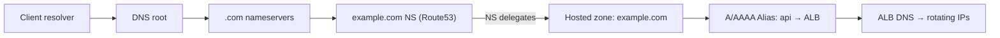

# Route 53

Route 53 is a scalable and highly available Domain Name System (DNS) web service designed to route end-user requests to internet applications hosted both inside and outside AWS. It translates human-readable domain names (like www.example.com) into IP addresses (like 192.0.2.1) that computers use to identify each other on the network. It can also register domain names, route internet traffic to the resources for your domain, and check the health of your resources.

## Key Features

1. **Domain Registration**: Route 53 allows you to register new domain names directly from the AWS Management Console.

2. **DNS Routing Policies**: You can configure various routing policies, including simple, weighted, latency-based, and geolocation routing, to control how traffic is directed to your resources.

3. **Health Checks and Monitoring**: Route 53 can monitor the health of your application endpoints and automatically route traffic away from unhealthy instances.

4. **Integration with Other AWS Services**: Route 53 is designed to work seamlessly with other AWS services, such as Elastic Load Balancing and Amazon S3.

5. **Traffic Flow**: This feature provides a visual editor to create complex routing configurations using a combination of different routing policies.

6. **DNSSEC**: Route 53 supports DNS Security Extensions (DNSSEC) to help protect against certain types of attacks, such as cache poisoning.

7. **Global Anycast Network**: Route 53 uses a global network of DNS servers to provide low-latency responses to DNS queries from users around the world.

8. **Cost-Effective**: With a pay-as-you-go pricing model, you only pay for the resources you use, making Route 53 a cost-effective solution for DNS management.


### Routing Policies
- **Simple Routing**: Routes traffic to a single resource.
- **Weighted Routing**: Distributes traffic across multiple resources based on assigned weights.
- **Latency-Based Routing**: Directs traffic to the resource with the lowest latency for the user.
- **Failover Routing**: Routes traffic to a primary resource and switches to a secondary resource if the primary becomes unhealthy.
- **Geolocation Routing**: Routes traffic based on the geographic location of the user.
- **Geoproximity Routing**: Routes traffic based on the geographic location of resources and users, with the ability to shift traffic by adjusting bias.


## Hosted Zones

Hosted zones are containers for records that belong to a single domain name. There are two types of hosted zones:

1. **Public Hosted Zones**: These are used to manage the DNS records for a domain that is accessible from the internet. They allow you to route traffic to your AWS resources, such as EC2 instances or S3 buckets.

2. **Private Hosted Zones**: These are used to manage DNS records for a domain that is only accessible within one or more VPCs. They allow you to create custom DNS names for your internal resources and control how traffic is routed within your VPCs.


## How resolution works (quick)


1. You type `api.example.com` in your browser. The browser or OS asks a resolver (often your ISP's). 
2. The DNS Resolution chain
    1. Root nameservers
        - They don't know your site, but they know who handles `.com`. They ask the .com nameservers.
    2. .com nameservers
        - They handle all the .com domains. They know who handles `example.com` (your Route 53 NS records). They ask those.
        - They say "ask these nameservers".
    3. Route 53 nameservers
        - It answers with the record for `api.example.com`, which is an Alias record pointing to an ALB.
    4. ALB DNS
        - The resolver now asks the ALB DNS name, which returns a rotating set of IPs.
3. The resolver returns the IP to your browser, which connects to it.



## Routing Traffic to S3 Static Websites

Route 53 can route traffic to static websites hosted in Amazon S3 buckets. This is a cost-effective solution for hosting static content like corporate websites, landing pages, or documentation sites.

### Prerequisites for S3 Website Hosting with Route 53

When integrating Route 53 with an S3-hosted static website, you must meet these requirements:

#### 1. Registered Domain Name
- You must have a registered domain name (e.g., `example.com`)
- Can be registered through Route 53 or any other domain registrar
- If registered elsewhere, you'll need to configure Route 53 as the DNS service

#### 2. S3 Bucket Name Must Match Domain Name
- **Critical requirement**: The S3 bucket name must be identical to the domain name
- For `www.example.com`, the bucket must be named `www.example.com`
- For `example.com`, the bucket must be named `example.com`
- This is required for the S3 website endpoint to work correctly

**Example**:
```
Domain: corporate.example.com
Required bucket name: corporate.example.com
```

### Configuration Steps

#### 1. Create and Configure S3 Bucket
```bash
# Create bucket with exact domain name
aws s3 mb s3://www.example.com

# Enable static website hosting
aws s3 website s3://www.example.com \
  --index-document index.html \
  --error-document error.html

# Set bucket policy for public read access
aws s3api put-bucket-policy \
  --bucket www.example.com \
  --policy '{
    "Version": "2012-10-17",
    "Statement": [{
      "Sid": "PublicReadGetObject",
      "Effect": "Allow",
      "Principal": "*",
      "Action": "s3:GetObject",
      "Resource": "arn:aws:s3:::www.example.com/*"
    }]
  }'
```

#### 2. Create Route 53 Record
- Record type: **A record** (or AAAA for IPv6)
- Use **Alias** record pointing to S3 website endpoint
- NOT an MX record (MX records are for email routing)

**Console steps**:
1. Go to Route 53 hosted zone
2. Create record:
   - Record name: `www` (or leave blank for apex domain)
   - Record type: A
   - Alias: Yes
   - Route traffic to: S3 website endpoint
   - Select region and bucket

**CLI example**:
```bash
aws route53 change-resource-record-sets \
  --hosted-zone-id Z123EXAMPLE \
  --change-batch '{
    "Changes": [{
      "Action": "CREATE",
      "ResourceRecordSet": {
        "Name": "www.example.com",
        "Type": "A",
        "AliasTarget": {
          "HostedZoneId": "Z3AQBSTGFYJSTF",
          "DNSName": "s3-website-us-east-1.amazonaws.com",
          "EvaluateTargetHealth": false
        }
      }
    }]
  }'
```

### Common Misconceptions

#### ❌ S3 Bucket Must Be in Same Region as Hosted Zone
- **FALSE**: Route 53 hosted zones are global resources
- S3 buckets can be in any AWS region
- Route 53 can route to S3 buckets regardless of region
- However, choose region closest to users for better latency

#### ❌ Record Must Be MX Type
- **FALSE**: MX records are for email routing (mail exchange)
- For website hosting, use **A record** (IPv4) or **AAAA record** (IPv6)
- Use Alias records to point to S3 website endpoints

#### ❌ CORS Must Be Enabled
- **FALSE**: CORS (Cross-Origin Resource Sharing) is not required for basic website hosting
- CORS is only needed when:
  - Client web app on one domain accesses resources on another domain
  - JavaScript makes API calls to different domain
  - Fonts, images, or other assets loaded from different origins

**When CORS IS needed**:
```
Scenario: www.example.com loads JavaScript that calls api.example.com
Solution: Enable CORS on api.example.com to allow requests from www.example.com
```

### S3 Website Endpoints by Region

Different regions have different S3 website endpoint formats:

| Region | Website Endpoint Format |
|--------|------------------------|
| us-east-1 | `bucket-name.s3-website-us-east-1.amazonaws.com` |
| us-west-2 | `bucket-name.s3-website-us-west-2.amazonaws.com` |
| eu-west-1 | `bucket-name.s3-website-eu-west-1.amazonaws.com` |
| ap-southeast-1 | `bucket-name.s3-website-ap-southeast-1.amazonaws.com` |

### Apex Domain vs Subdomain Setup

#### Subdomain (www.example.com)
```
1. Bucket: www.example.com
2. Route 53 A record: www.example.com → S3 alias
```

#### Apex Domain (example.com)
```
1. Bucket: example.com
2. Route 53 A record: example.com → S3 alias
3. Optional: Create www.example.com bucket that redirects to example.com
```

### Redirect Configuration (www to apex or vice versa)

**Scenario**: Redirect `www.example.com` to `example.com`

1. Create primary bucket: `example.com` (with website content)
2. Create redirect bucket: `www.example.com` (configured for redirect)

```bash
# Configure redirect bucket
aws s3 website s3://www.example.com \
  --redirect-all-requests-to '{"HostName": "example.com", "Protocol": "https"}'
```

3. Create Route 53 records for both:
   - `example.com` → points to main S3 bucket
   - `www.example.com` → points to redirect bucket

### Best Practices

1. **Use CloudFront**: Add CloudFront distribution for HTTPS and better performance
   ```
   Client → Route 53 → CloudFront → S3 bucket
   ```

2. **Enable Versioning**: Protect against accidental deletions
   ```bash
   aws s3api put-bucket-versioning \
     --bucket www.example.com \
     --versioning-configuration Status=Enabled
   ```

3. **Set Up Logging**: Track access to your website
   ```bash
   aws s3api put-bucket-logging \
     --bucket www.example.com \
     --bucket-logging-status '{
       "LoggingEnabled": {
         "TargetBucket": "logs.example.com",
         "TargetPrefix": "www-logs/"
       }
     }'
   ```

4. **Configure Custom Error Pages**: Improve user experience
   - 404.html for not found errors
   - 500.html for server errors

5. **Use Route 53 Health Checks**: Monitor website availability
   ```bash
   aws route53 create-health-check \
     --health-check-config \
       IPAddress=s3-website-endpoint,Port=80,Type=HTTP,ResourcePath=/
   ```

### Troubleshooting

**Issue**: "NoSuchBucket" error when accessing website
- **Cause**: Bucket name doesn't match domain name exactly
- **Solution**: Recreate bucket with exact domain name

**Issue**: 403 Forbidden error
- **Cause**: Bucket policy doesn't allow public access or block public access settings enabled
- **Solution**: Update bucket policy and disable block public access

**Issue**: Route 53 doesn't show S3 endpoint option
- **Cause**: Static website hosting not enabled on bucket
- **Solution**: Enable static website hosting in S3 bucket properties

**Issue**: DNS not resolving
- **Cause**: NS records not updated at domain registrar
- **Solution**: Update domain registrar to use Route 53 name servers

## Route 53 Zones