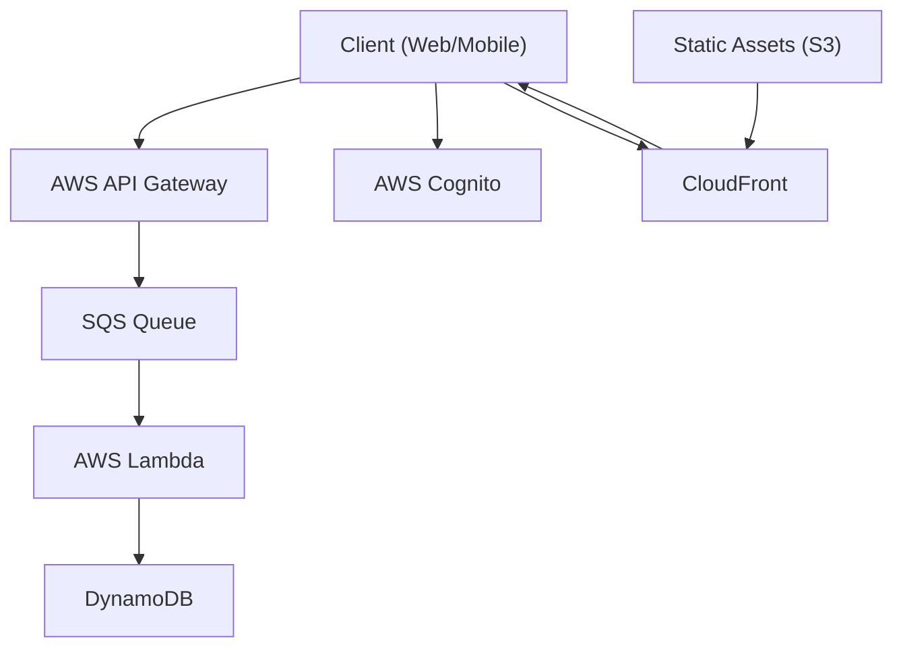

# Serverless Compute services
When it comes to serverless compute on AWS, the two main services to consider are **AWS Lambda** and **Amazon ECS Fargate**. Both services allow you to run code without managing servers, but they have different use cases and characteristics.
## AWS Lambda
AWS Lambda is a serverless compute service that lets you run code in response to events and automatically manages the underlying compute resources for you. You can use Lambda to run code for virtually any type of application or backend service, all with zero administration. 

## Amazon ECS Fargate
Amazon ECS Fargate is a serverless compute engine for containers. It allows you to run containers without having to manage the underlying infrastructure. With Fargate, you can focus on designing and building your applications instead of managing the infrastructure that runs them.

## When to use which?

| If you have | AWS Lambda | ECS Fargate  |
|---------------|-------------|---------------|
| Workload to lift and shift<br/> with minimal rework |          | 🟡           |
| Longer running processes or <br> larger deployment packages |          | 🟡           |
| Predictable, consistent <br/> workloads |          | 🟡           |
| Tasks that take less than <br/> 15 minutes to complete | 🟡      |               |
| Spikey or unpredictable<br/> demand | 🟡      |               |
| Event driven fits naturally<br/> SQS/SNS/EventBridge,<br/> S3, API Gateway | 🟡      |               |
| You can live with cold starts | 🟡        |            |
| No need of sidecar containers | 🟡        |            |
| GPU workloads | 🔴         | 🔴  (Use EC2/EKS)           |
| Need of larger ephemeral storage | 🟡         |            |
| Container image portability<br/> with Docker runtime |           | 🟡          |

## Operational notes
- You might find that combining both services also works, e.g. having an ECS Fargate that can be triggered with AWS Step Functions alongside Lambda functions.
- Scale behaviour: Lambda scales near-instantly to meet demand, while Fargate scales based on the defined service parameters and can take longer to adjust to sudden spikes in traffic.
- Networking: Both can live in a VPC.
- Observability: Both push logs to CloudWatch. X-Ray is supported on both, but Lambda has built-in tracing capabilities.
- Cost rule-of-thumb:
    - Bursty/low idle → Lambda often cheaper.
    - Always-on small to medium service → Fargate (or even EC2) can win.


## Example architectures
- Probably the easiest use-case is to replace a CRON job with a Lambda function triggered by EventBridge Scheduler.
- Another use case is replacing routine or data processing jobs with Step functions invoking Lambda functions.
    - [Kedro Step functions deployment example](https://docs.kedro.org/en/0.17.7/10_deployment/10_aws_step_functions.html)
    - SG Rule Modification -> CW Event -> AWS Config -> AWS Lambda to remediate non-compliant resources
    ```mermaid
    graph TD;
        A[SG Rule Modification] --> B[CloudWatch Event];
        B --> C[AWS Config];
        C --> D[AWS Lambda];
        D --> E[Remediate non-compliant resources];
        D --> F[SNS Notification];
        F --> G[Send Email];
    ```


## Serverless web applications and mobile apps

The pattern that opened the event-driven architecture module forms the basic backbone of a serverless web application architecture.

<!-- mermaid: client -> AWS API Gateway -> SQS -> Queue -> AWS Lambda DynamoDB -->
<!-- mermaid architecture diagram -->

- API gateway handles incoming HTTP requests from clients (web or mobile applications).
- Lambda provides the application layer.
- DynamoDB serves as the database to store application data.
- Cognito manages user authentication and authorization.
- SQS decouples the API Gateway from Lambda, allowing for better scalability and fault tolerance.