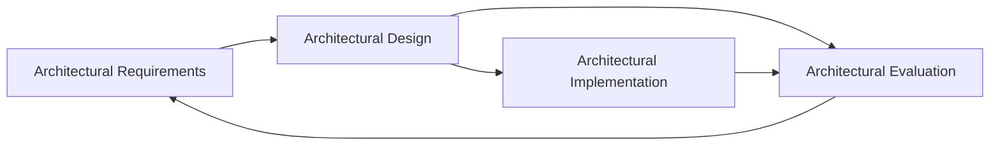
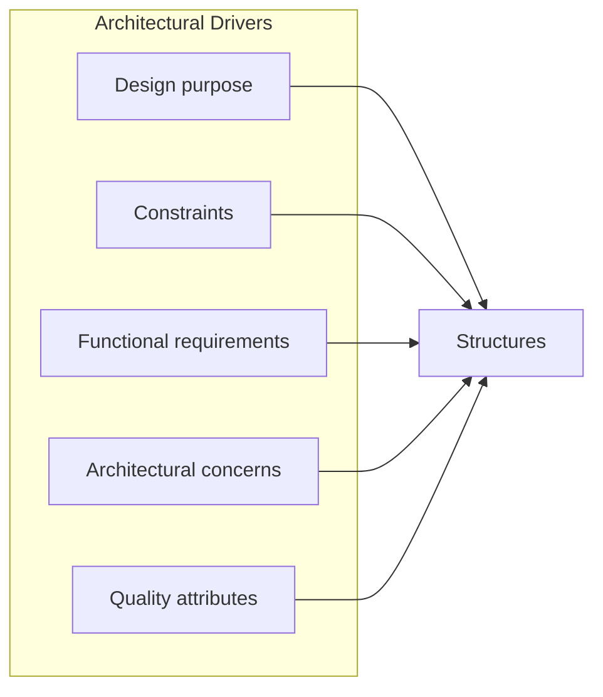

---
title: Software Architecture Notes
category: Architecture
tags: [architecture, requirements, quality-attributes, documentation, evaluation]
description: Notes on software architecture concepts, drivers, documentation, and evaluation processes.
status: notes
---
 
# Software Architecture Fundamentals

## Table of contents
- [Overview](#overview)
- [Why architecture matters](#why-architecture-matters)
- [Requirements and drivers](#requirements-and-drivers)
  - [Architecturally Significant Requirements (ASRs)](#architecturally-significant-requirements-asrs)
  - [How to identify ASRs](#how-to-identify-asrs)
- [Architectural documentation](#architectural-documentation)
- [Architecture evaluation](#architecture-evaluation)
- [Pragmatic questions](#pragmatic-questions)
- [Architect role and duties](#architect-role-and-duties)
- [Steps of software architecture](#steps-of-software-architecture)
- [From drivers to structures](#from-drivers-to-structures)
- [Principle: focus on why](#principle-focus-on-why)

## Overview

This document is a set of personal notes regarding how to prepare and present architectural or any kind of decisions, solutions or designs. It is based on my notes reading [Designing Software Architectures: A Practical Approach](https://www.informit.com/store/designing-software-archite ctures-a-practical-approach-9780134390789?w_ptgrevartcl=Architectural+Design_2738304) as well as my experience as a Software Engineer.

The [Software Architecture](https://en.wikipedia.org/wiki/Software_architecture) can be described with the following definition. 

> The Software Architecture of a system is the set of structures needed to reason about the system. These structures comprise software elements, relations among them and properties of both. 

### Why architecture matters

The software architecture is important for the following reasons
- Architecture determines the system's driving [quality attributes (QAs)](https://en.wikipedia.org/wiki/List_of_system_quality_attributes), also known as [Non-functional requirements (NFRs)](https://en.wikipedia.org/wiki/Non-functional_requirement).
- Architecture decisions help you reason in future need of changes
- Analysis of architecture enables early prediction of a system's qualities
- Defines a set of constraints on subsequent implementation
- Influences the structure of an organisation.

### Requirements and drivers

Part of the architectural or any kind of problem is the set of [requirements](https://en.wikipedia.org/wiki/Software_requirements). There are whole subfields of Software and Systems Engineering called [Requirements Analysis](https://en.wikipedia.org/wiki/Requirements_analysis) and [Requirements Engineering](https://en.wikipedia.org/wiki/Requirements_engineering) that are worth noting, but can be covered at a later stage of the document. Architectural requirements could be Functionality, High Performance, High Availability, Ease of evolution, Security.

What [Software Design](https://en.wikipedia.org/wiki/Software_design) is can be expressed with the following diagram.

### Architecturally Significant Requirements (ASRs)

There's a certain subset of those requirements that we call [Architectural Significant Requirements (ASRs)](https://en.wikipedia.org/wiki/Architecturally_significant_requirements). Those can be defined in the following way

>  [Architectural Significant Requirements (ASRs)](https://en.wikipedia.org/wiki/Architecturally_significant_requirements) are the set of functional or non-functional requirements that significantly impact a system's architectural design. They should be given a special priority since they are crucial for establishing a sound architecture. 

Often those are
- [quality attributes (QAs)](https://en.wikipedia.org/wiki/List_of_system_quality_attributes)
- missions
- constraints
 
### How to identify ASRs
- Requirement Documents
	- [Product requirement documents](https://en.wikipedia.org/wiki/Product_requirements_document)
	- [NFRs/QAs documents](https://www.modernrequirements.com/blogs/what-are-non-functional-requirements-and-how-to-build-them/)
- [User Stories](https://www.atlassian.com/agile/project-management/user-stories)
- [Quality Attribution Workshops (QAWs)](https://www.sei.cmu.edu/library/quality-attribute-workshop-collection/)
- [Stakeholder Interviews](https://www.nngroup.com/articles/stakeholder-interviews/)

## Architectural documentation

A major process that accompanies the Architecture design is the [architectural documentation](https://www.reddit.com/r/softwarearchitecture/comments/mlf47q/what_to_cover_in_a_software_architecture_document/) one. The architectural documentation provides a high-level blueprint of a software system, detailing its components, structures, and key design decisions to ensure common understanding among various stakeholders.

### Architecture evaluation

After architecture has been designed or implemented, a natural step that comes is evaluating the solution/architecture. The process can be described with the following diagram

#### Pragmatic questions

When doing architectural design two pragmatic question come up
- How much to design upfront versus how much to defer until requirements have solidified somewhat?
- How much to document?

### Architect role and duties
- leadership - mentorship, team-builder
- communication
cp - negotiation - stakeholders, needs, expectations
- technical skills
	- life cycle skills
	- technical planning and estimation
	- evaluation
	- documentation
- project management skills
	- budgeting, personnel, schedule management, risk management
- analytical skills

## Architectural Design

Design means making decisions to achieve goals and to satisfy requirements and constraints.

### Steps of software architecture

- **Requirements gathering**
    - Collect both functional requirements (what the system should do) and non-functional ones (performance, availability, security, compliance, usability).
    - Identify stakeholders: business, product, end users, ops, security, compliance, etc.
- **Identify architectural drivers**
    - From that big messy list, pull out what really shapes the design: critical features, key quality attributes, constraints, and business goals.
    - This is where you clarify priorities (e.g. “uptime beats cost” or “compliance beats usability”).
- **Design candidate architectures**
    - Sketch structures (components, modules, deployment diagrams) guided by the drivers.
    - Explore patterns and tactics that address the QAs (e.g. caching for performance, redundancy for availability).
    - Expect multiple options, not just one.
- **Evaluate and trade off**
    - Stress-test candidates against scenarios (ATAM, quality attribute scenarios, prototypes, benchmarks).
    - Make trade-offs explicit (what you’re gaining vs. giving up).
    - Document key decisions (ADRs).
- **Refine into concrete architecture & communicate**
    - Finalize the chosen structure.
    - Produce views for different audiences (C4 diagrams, deployment diagrams, runtime views).
    - Share and iterate — architecture is only real if people understand and align on it.
- **Ongoing evolution** _(bonus step)_
    - Architecture is never “done.” Monitor whether it holds up under changing requirements and scale.
    - Revisit assumptions, update ADRs, evolve the design.

### From drivers to structures

The process of architecture seem very similar to the process of data analysis and modeling. You search through a space of possible solutions (models) until finding an acceptable one.

When we talk about design, we have the following interwined definitions that encompass arcitectural design.

1. **Structural Elements** - The key components or modules of the software and their relationships.
2. **Elements Internal Design** - Designing the internal functionality of a component/element.
3. **Elements Interaction Design** - Contracts and communication design between components/elements.
4. [Architectural Deisgn](https://en.wikipedia.org/wiki/Software_architecture) identifies and defines major elements and important relationships that make up the overall structure of a system. It also identifies the elements' responsibilities. The architectural design includes defining the high level structure. Software architectural design is the process of creating the high-level blueprint for a software system, outlining its fundamental structure, components, interfaces, and their interactions to meet technical and business requirements, such as performance, scalability, and security.
5. [Systems design](https://en.wikipedia.org/wiki/Systems_design) is the broader umbrella: how all the pieces of a system (software, hardware, data, people, processes) fit together to meet requirements. It cares about flows, interfaces, performance, and reliability—basically the mechanics of how the system functions.

### Principles and Notes

> Early on, initila architecture is critical for estimations in project proposals.

> When thinking about design, think about what has been needed in the past, especially if you've been in the company for some time.

> **Top-down approach** - Start from the top in understanding a system and leave components and structures as black boxes.

### Architectural Drivers

There was a good principle expressed in [Designing Software Architecture](https://www.amazon.com/Designing-Software-Architectures-Practical-Engineering/dp/0134390784)
> You need to think of what you are doing and why. Those 'what' and 'why' questions are the [architectural drivers](https://www.informit.com/articles/article.aspx?p=2738304&seqNum=4).

The principle is is actually for architecture design, but can be applied to a broader set of problem types. The "why" actually connects to [Polya](https://en.wikipedia.org/wiki/George_P%C3%B3lya)'s first principle of [how to solve](https://en.wikipedia.org/wiki/How_to_Solve_It) a problem - Understand the problem. 

The usual architectural drivers are
- Design purpose
- [quality attributes](https://en.wikipedia.org/wiki/List_of_system_quality_attributes)
- primary functional requirements
- architectural concerns
- constraints

#### Design Purpose
**Why are you doing the design?** Which business goals is the organization most concerned about at the moment?

Develolopment organizational goals might also affect the architectural design process, for example they might want designing for
- reuse
- [future software extensibility](https://en.wikipedia.org/wiki/Extensibility)
- [scalability](https://en.wikipedia.org/wiki/Scalability)
- [Continuous Delivery](https://en.wikipedia.org/wiki/Continuous_delivery)
- Team member skills
- Utilization and integration with existing projects
- High level executives technological preferences and biases

> 🚨 Establish a clear design purpose. Negotiate and communicate that purpose before beginning the design process. 🚨

#### [Quality Attributes](https://en.wikipedia.org/wiki/List_of_system_quality_attributes) or [Non-functional requirements](https://en.wikipedia.org/wiki/Non-functional_requirement)

> [Quality Attributes](https://en.wikipedia.org/wiki/List_of_system_quality_attributes) are measurable or testable properties of a system that are used to indicate how well the system satisfies the needs of its [stakeholders](https://www.viewpoints-and-perspectives.info/home/stakeholders/).

Among the architectural drivers, the quality attributes are the ones that most strongy shape the architecture.

There are different methods that help in determining quality attributes
- [Utility trees](https://www.pisakov.com/posts/utility-tree-in-software-architecture/)
- [The quality attribute workshop](https://www.sei.cmu.edu/library/quality-attribute-workshop-collection/)
- [Mission thread workshop](https://www.sei.cmu.edu/library/mission-thread-workshop/)

> 🚨 The best way to discuss, document and prioritize quality attribute requirements is as a set of [scenarios](https://medium.com/@anil.goyal0057/quality-attribute-scenario-a-way-to-define-software-quality-requirements-71dd82f4be1b).

> A scenario in it's most basic form is a system's response to some stimulus.

Scenarios are testable, falsifiable hypotheses about the quality attribute behaviour of a system under consideration.

### Scenario Prioritization Mechanism (Where to put architectural focus)

That is done by considering two dimensions of the scenario.

1. Importance of the scenario with respect to the success of the system. This is ranked by the customers. You/They can use likert scale or L/M/H for the importance.

2. Degree of technical risk associated with the scenario. This is ranked by the architect.
    - Complexity
    - Novelty
    - Uncertainty

| Risk \ Importance | Low | Medium | High |
|-------------------|-----|--------|------|
| **Low**           | Don't over-invest     |        | Watch out for  wasted effort     |
| **Medium**        |     |        |      |
| **High**          |Plan carefully   but less worry     |        | focus  here |

### Primary Functionality

> Functionality is the ability of a system to do the work for which it was intended.

> ❗ Design structure should not influence functionality in most cases.

> **Primary Functionality** is the one that is critical to achieve the business goals that motivate the development of the system. 

The primary functionality is usually defined as used stories and usually focuses on happy paths.

> 👍🏿 **Rule of thumb** 👍🏼 Approximately 10% of user stories are likely to be primary.

#### Why you need to consider primary functionality when designing a system or architecture? Think about how to
1. Allocate functionality to elements that promote modifiability or reusability and to plan work assignments.
2. Connection between primary functionality and quality attributes

### Architectural Concerns

- General concerns - thse are broad issues that you must deal with when creating or designing an architecture
    - system structure
    - allocation of functionality to modules
    - code base allocation
- Specific conerns 
    - system internal issues
    - exception management and handling
    - configurations
    - logging
    - authentication
- Internal requirements
    - timezones
    - currencies
- Issues - e.g. Security

### Constraints (little or no control by the architect) 
- mandated technologies
- other systemslaws
- team
- non-negotiable deadlines
- backward compatability
- open source technologies

# Making Design Decisions
 TBD TBD TBD TBD TBD TBD TBD TBD