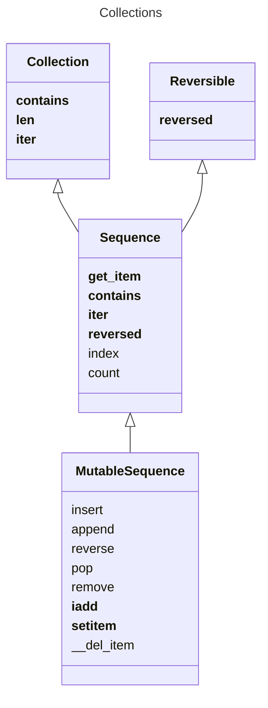

# Notes on Python

### Modules, pyproject
When running

```bash
python -m src.snakesay
```

python adds the current path but it doesn't add the `snakecase` directory path, while with

```bash
python src/snakesay
```

`python` will add the snakesay directory to the path.

- We use a pyproject.toml file. To install our project we use `python -m pip install -e .`. `-e` is for editable 
- It might be better to use absolute paths with installed modules instead of relative paths to modules. Works in every case and it's generic.

### Built-in Sequences

One way to classify sequences is by homogeneity

- Container Sequences - Can hold items of different types, including nested containers
    - list
    - tuple
    - collection.deque
- Flat Sequences - does not hold references
    - str
    - bytes
    - array.array

Another classification of sequences is by mutability

- Mutable sequences
    - list
    - bytearray
    - array.array
    - collections.deque
- Immutable sequences
    -tuple
    -str
    -bytes

- Every Python object in memory has a header with metadata. The simplest Python object, a float, has a value field and two metadata fields:
    - ob_refcnt: the object’s reference count
    - ob_type: a pointer to the object’s type
    - ob_fval: a C double holding the value of the float




Tuples are more memory-efficient than lists in Python. This is because tuples are immutable, which allows Python to optimize for memory usage and performance in ways that aren't possible with mutable types like lists.

When Python creates a tuple, it allocates just enough memory to store the values in the tuple and no more. Because the tuple can't change, Python knows that it won't need to allocate any additional memory for the tuple.

On the other hand, when Python creates a list, it allocates more memory than is needed to store the current values. This extra memory allows you to add more items to the list without needing to allocate more memory, but it also means that lists use more memory than tuples when storing the same values.

In most cases memory efficiency is not important when choosing whether to use list or a tuple


- In software engineering, a fluent interface is an object-oriented API whose design relies extensively on method chaining. Its goal is to increase code legibility by creating a domain-specific language (DSL). The term was coined in 2005 by Eric Evans and Martin Fowler.[1]


### Python interview questions

##### Get to know questions
- Tell me about yourself? About previous projects you've worked on.
- What would you say are the challenges you had in those projects.
- Do you have a favorite Software Engineering/Computer Science book?

##### General language questions
- Q: What do you like about using Python? What would you say is the main philosophy of Python?
- Q: What is the Zen of Python? What is meant by the "pythonic way"?
- Q: What is Python good for? When would you choose Python and when something else?
- Q: Have you heard of the Python data model? What is it? What are dunder/special methonds?
- Q: What are the different variable types in Python?
- Q: What is the difference between lists and tuples? Which is more memory efficient?
- Q: When should you use tuples and when should you use lists?
- Q: What is the difference between a list and an array? When you should use array? Is there an alternative to using an array? When should you use array and when that alternative (np)?
- Q: If you have millions of records and you need to insert at back, what data structure you should use? If at front? If both at front and at back?


- Q: What will happen with the following example
```python
arr = [1] * 5
arr
```

- Q: What will happen with the following example. What would be the output

```python
arr = [{}] * 5
arr[1]["a"] = 12
arr
```
- Q: Why the above behaviour happens?
- Q: How can you solve the above problem? Answer:
```python
arr = [{} for _ in range(5)]
arr[1]["a"] = 12
```


### Dictionaries

> The main value of the ABCs is documenting and formalizing the standard interfaces
> for mappings, and serving as criteria for isinstance tests in code that needs to sup‐
> port mappings in a broad sense:

##### What is hashable?

An object is hashable if it has a hash code which never changes during its lifetime (it
needs a __hash__() method), and can be compared to other objects (it needs an
__eq__() method). Hashable objects which compare equal must have the same hash
code.

Numeric types and flat immutable types str and bytes are all hashable. Container
types are hashable if they are immutable and all contained objects are also hashable.
A frozenset is always hashable, because every element it contains must be hashable by definition.
A tuple is hashable only if all its items are hashable. See tuples tt, tl, and tf:


##### Oredered Dicts
- good for reordering
- has a move_to_end method
- can handle frequent reorderings


# Object references, Mutability and recycling

- variables are labels with names attached to objects, not boxes
- tuples are immutable but their values may change

An object’s identity never changes once it has been created; you may think of it as the object’s address in memory. The is operator compares the identity of two objects; the id() function returns an integer representing its identity.

### Data classes
- Good for scaffolding
- Good for intermediate representations, like for json objects. But they don't have validation.

Seeking 100% coverage of type hints is likely to stimulate type hint‐ ing without proper thought, only to satisfy the metric. It will also prevent teams from making the most of the power and flexibility of Python. Code without type hints should naturally be accepted when annotations would make an API less user-friendly, or unduly complicate its implementation.


- Types Are Defined by Supported Operations
- Nominal typing - declare types and more strict contracts
- Duck typing - In languages like Python and Javascript, objects can have whatever type they like and we can pass them to functions. Those functions can execute certain methods, and if the passed object has those methods, we can consider the type of the object the thing we expect from the function.

```python

class Human:
    def talk():
        print("talk")
    def quack():
        print("quack")


def fly(duck):
    duck.quack()
```

What the above means is that Python/Javascript doesn't have strong expectation/contracts on types of arguments in functions, it just requires that when calling a method of the object, that object exists.

- Duck typing is more flexible at the cost of risking introducing bugs
- Nominal typing is usually associated with static typing, but you can create your own checks for classes with isinstance and make nominal typing in a dynamic (runtime) setting
- Duck typing is easier to get started and is more flexi‐ ble, but allows unsupported operations to cause errors at runtime.
- Nominal typing might be better for large code bases
- Nominal typing is like additional regulation on cross roads (codebases). For small cross roads (codebases) it doesn't help much and it makes the process heavy, but for big cross roads (code bases) it prevents crashes (bugs).


### Control flow

```python
from colleciton import abc

class GooseSpam:
    def __iter__(self):
        pass

issubclass(GooseSpam, abc.Iterable) # True

goose_spam = GooseSpam()
isinstance(goose_spam_can, abc.Iterable) # True

```

But in the same time

```python
class Spam:
    def __get_item__(self):
        print("something")
        raise IndexError()
spam_can = Spam()
iter(spam_can)
[]
from collections import abc
isinstance(spam_can, abc.Iterable) # False
```


Use the Iterator pattern
- to access an aggregate object’s contents without exposing its internal representation.
- to support multiple traversals of aggregate objects. - Each __iter__ must return a new iterator and each iterator must keep it's own internal state
- to provide a uniform interface for traversing different aggregate structures (that is, to support polymorphic iteration).
- to separate the logic of the object from the actual iteration.
    